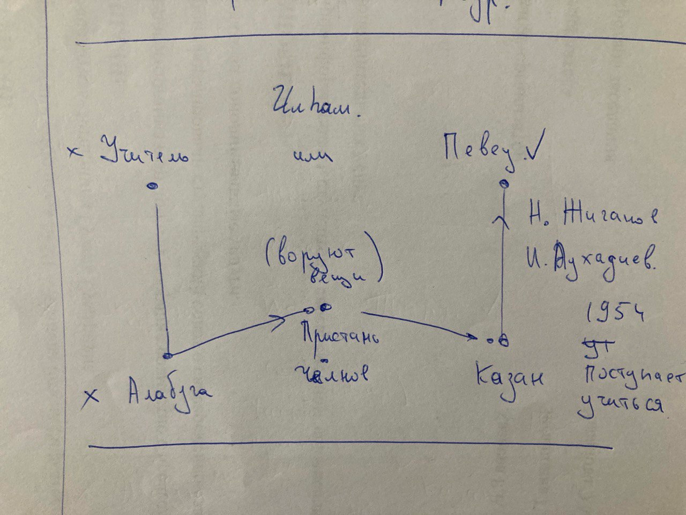

# 1. презентация для лекции шакирова
## 1.1. вводный / кереш
## 1.2. род / нәселе
Бабасы Мөхәммәтшакир - сәгатьләр төзәтүче. Торган җире - күпер төбендәге йорт. Әтисе Гыйльметдин - тимерче.
1927 елда Таулыктан -> Яңа бүләккә күчәләр

**1yanaBulyak**

## 1.3. семья / гаиләсе 1
Гаиләдә 6 бала туа.
Арасыннан Илһам Шакиров - төпчеге.

**2tuuTaniklik**

## 1.4. семья / гаиләсе 2
Фото с семьей. Дизайн с деревом и овалами

**3gailya**

## 1.5. рождения шакиров / илһам шакиров тууы
1935 елның 15 феврале. Казан каласында - "-13". 
Шакировлар яшәгән урын - урман буендагы йорт.

**4**

## 1.6. первые воспоминание шакирова / илһамның беренче хәтирәләре
Беренче моңнары анасыннан алган. Беренче җырлауларын 3 - 4 яшьләреннән хәтерли.
"Бик моңлы бала булдың инде" - *әнисенең сүзләре* / слова матери.

**5**

## 1.7. не печальтесь / моңаймагыз әле
> Әниебез Нуриәсма белән өйдә икәү генә калсалар, и **тотынырлар** иде җырларга, ишегалдына ишетелеп торыр иде. Җитте, тагын кемнең башына җитәргә җырлыйсыз, әтинең башына җиттегез бит дип тә әйтеп карыйбыз, юк.

**6**

## 1.8. музыкаль обстановка
Татарстан Радиосында пионер җырчы - **Гөлсем Сөләйманова**.
Популяр җырлар исемлеге / список популярных песен.

**7** 
Фото певицы

## 1.9. трудности / авырлыклар
1937 ел. Әтисе Гыйльметдин "халык дошманы".
Текст обвинения.

**8**
годы большого террора

>> герман көе. играет абдрахимов

## 1.10. годы большого террора / бөек террор еллары
Видео про террор, про нищету.

## 1.11. печали войны / сугыш бәласы
Сугыш башланды. Авылларда егетләрне сугышка озаталар. Озату җырлары яңгырый.

**9**
что то про войну можно

## 1.12. про песню германская мелодия / герман көе турында
Приводим текст песни.
[https://erlar.ru/node/4911]

<!-- То как пел Шакиров -->

<!-- То как пели про провожании его брата.

> Басу капкысын чыкканда,  
Күтәрелде томаннар,  
Дөнья хәлен белеп булмый,  
Сау булыгыз, туганнар. -->

## 1.13. печали войны / сугыш бәласы 2
Егетләр китә, авырлык хатын кызлар өстенә төшә. Халык сугыш белән башка нәрсәләрне уйламыйча, үзе музыкаль сугыш лирикасын булдыра. Су буйлап, Озату, Шомыртым кебек көйләр туа.
Барсына да Илһам шаһит була -- уй - кичерешләре белән яши, халык тудырган җырларын ота.

**10**

## 1.14. учеба в школе / мәктәптә уку
үз авылында 7 еллык мәктәптә укый, акча булмау сәбәпле бер елын акча эшләп уздыра. Яраткан фәннәре - математика, физика, татар әдәбияты.

## 1.15. запись хор молодых колхозников / яшь колхозчылар хоры язмасы

**Йолдызым**
Песня

## 1.16. выбор профессии / укырга керү мизгеле
1954 елны Илһам Шакиров мәктәпне тәмамлый.

Схема как можно было бы сделать

**12honarSaylay**

## 1.17. упадничество / төшенкелек
текст как ильгам шакиров чуть не погубил себя в воде

> миннән бәхетсез бала юк икән. пароходта барганда суга ташланырга ничә мәртәбә пароход койрыгына бардым, әнкәйне кайтып күрәсе килү генә тотып калды.  

*апасына хатыннан*

## 1.18. стихотворение Роберта Ахметзянова / Роберт Әхмәтҗан шигыре

Текст стиха.

>> өзелгәнсең сиреньнән

звучит аудиозапись

